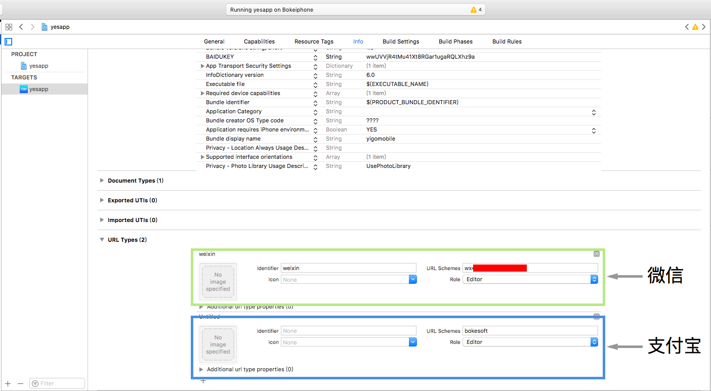

# 开发步骤描述

## 准备工作

### 申请App支付帐号
> 当前只支持微信和支付宝的App支付，两者都提供了非常详细的帐号申请相关文档
，所以我们不赘述申请过程，只会详细描述一下申请完成之后需要从帐号中提取的信息，
两者最终会产生一些参数，主要包括一些安全性校验使用到的公钥和私钥，这些信息都被保存在
Sys_Para这张表中

+ 公用

    * PAY_NOTIFYURL

        >这个参数是一个Http地址，指向支付的异步回调服务，在系统中已经默认有一个Servlet提供这个服务，具体的服务名是
        PayNotify，如果yes的服务器地址是http://localhost/yigo,那么回调地址就是http://localhost/yigo/PayNotify


+ 微信

    [注册过程][1]

    * WECHAT_APPID

        >微信申请用于支付的APPID,都是以wx开头的

    * WECHAT_PARTERID

        >微信申请之后的商户ID,开通微信app支付时使用的帐号

    * WECHAT_APIKEY

        >微信的APIKEY

    * WECHAT_CERT_PATH

        >用于退款的证书地质，这个证书需要登陆微信，然后从注册的app的详细信息中进行下载,这个参数的内容是证书存放的
      本地路径

+ 微信扫码

    [注册过程][1]

    * WECHAT_B_APPID

        >申请微信扫码支付的微信公众号ID

    * WECHAT_B_PARTERID

        >微信申请之后的商户ID,开通微信app支付时使用的帐号

    * WECHAT_B_APIKEY

        >微信的APIKEY

    * WECHAT_B_CERT_PATH

        >用于退款的证书地质，这个证书需要登陆微信，然后从注册的app的详细信息中进行下载,这个参数的内容是证书存放的
      本地路径


+ 支付宝

    [注册过程][2]

    * ALIPAY_APPID

        >支付宝APPID

    * ALIPAY_PRIVATEKEY

        >私钥，这个私钥是在完成注册之后，由注册方上传的，用于生成签名

    * ALIPAY_ALI_PUBLICKEY

        >支付宝的公钥，用于验证从支付宝发送过来的信息的合法性


## 服务器端部署

+ jar包复制

    >复制lib目录下的所有文件到web-inf\lib目录下
+ 修改yes项目配置中的Enhance.xml文件

    >在ExtService段中增加如下代码

    ```xml
    <Service Name="PaymentService" Destription="支付服务" Impl="com.bokesoft.yes.yespay.PaymentService"/>
    ```
+ 参数设置
　
    >在数据库表SYS_PARA中添加支付相关的参数，这些参数这些参数很重要，具体的参数请参考本文档准备工作中的描述。

+ 开发服务端支付回调借口实现

    >每个项目都要自己开发支付完成的回调接口实现,具体接口的描述参考interface.md文件中的相关内容。
    在完成接口实现的开发之后需要把实现类打包放置到服务器可以找到的classpath上，建议是单独打成一个jar包，防止到lib目录下

## 数据库

> 数据库中需要增加一张表用于记录支付的结果信息，表名是SYS_PAYMENTINFO，这个表示和默认的IPaymentResultPersistService有关系的，
如果项目中使用自己的支付结果保存实现，则可以不用这张表。

```sql
create table SYS_PAYMENTINFO(
    TicketCode varchar(100) not null,
    Data varchar(4000)
)
```

> 之后这张表会自动创建，手动创建表只是临时方案

## 客户端

>客户端只需要使用最新的app就可以支持pay和refund这两个函数,基本上客户端无法直接使用平台提供的现成的
apk,需要项目订制app项目。

### Android

>平台打包给出的apk的packageName是com.bokesoft.yes.mobile,这个是手机应用的唯一标示，这个标识
在微信支付的时候是必须和申请的支付appId对应的，所以平台默认打包的应用，绑定的是博科公司的支付帐号，
项目中如果要使用客户公司申请的帐号，则这个packageName必须要修改，也就是说必须订制一个app应用，项目
自己新建一个Android的项目，引用平台提供的开发包中的相关库。

#### 微信支付

* package-name

    >这个属性在微信支付的注册过程中需要填写到微信支付帐号的相应设置信息中，定义在Android项目中的
    AndroidManifest.xml文件中。

* WXPayEntryActivity

    >这个类的名字和路径必须按照微信的要求设置，名字不能修改，包路径必须是package-name.wxapi,这里的package-name,
    就是当前应用的package-name,定义在AndroidManifest.xml文件中，这个类可以从com.bokesoft.yes.mobile.WXPayEntryActivity
    中继承下来，不需要些任何其他代码。

### IOS

>IOS需要在info.plist文件中设置两种支付方式对应的urlschema,用于在完成支付之后从支付应用跳回到当前应用，urlschema必须设置
成当前应用的appId,也就是申请的支付帐号对应的appId.



## yigo函数

### Pay(code,amount,desc,success,fail)

>支付函数，这个函数没有返回值，后续操作通过success和fail这两个参数执行，但是在这两个后续脚本中，不要执行业务层上的代码，
真正的支付结果通知会通过异步回调的方式回调。

+ code

    业务单据号，需要保证整个应用唯一

+ amount

    金额，以元为单位

+ desc

    对本次支付的描述

+ success,fail

    两个字符串，内容是yigo的脚本，分别在支付成功和失败后调用

### Refund(code,totalAmount,refundAmount)

>退款函数，这个函数返回一个boolean值

+ code

    付款时候使用的单据号

+ totalAmount

    总金额

+ refundAmount

    退款金额

## 支付模块的一些注意事项

1. Pay函数的所有金额参数都是字符串
2. 重复支付问题
    Pay函数只是提供了支付框架，依赖于第三方支付平台的功能，同一张单据号是不可能发生重复支付的，但是如果业务平台上一张单据可能存在多次支付的情况，那么实际单据号和支付单据号必须管理好，以避免重复支付。
3. 

  [1]: http://jingyan.baidu.com/article/3a2f7c2e76314a26afd6119b.html       "wechat"
  [2]: http://zhihu.com/question/27246921/answer/42729752  "alipay"